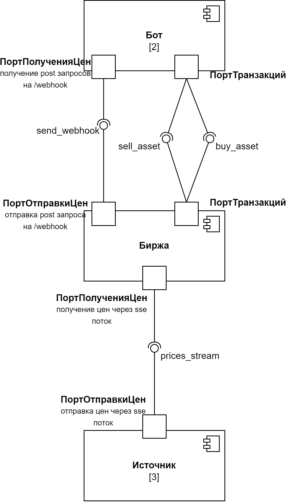

# Способы сетевого взаимодействия. Документация о проделанной работе
Боты и биржа взаимодействуют через
**webhooks**, биржа и источники — через 
**sse**.

## Диаграмма взаимодействия компонент
Для построения диаграммы был выбран UML.

## Инструкция по запуску
Создать виртуальное окружение:
```bash
python3 -m venv env
```
Запустить виртуальное окружение:
```bash
. env/bin/activate
```
Установить необходимые зависимости:
```bash
pip install -r requirements
```
Все URL для чистоты хранятся как
переменные виртуального окружения. 
Файл `.env` заливать в репозиторий нехорошо,
поэтому следует выполнить следующую команду:
```bash
mv .env.example .env
```
Теперь можно запускать сервисы!
```bash
python3 src/resources.py
python3 src/stock_exchange.py
python3 src/bots.py
```
